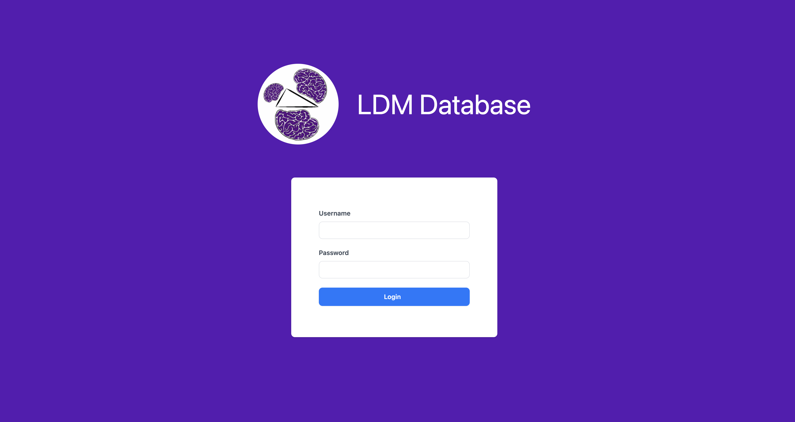
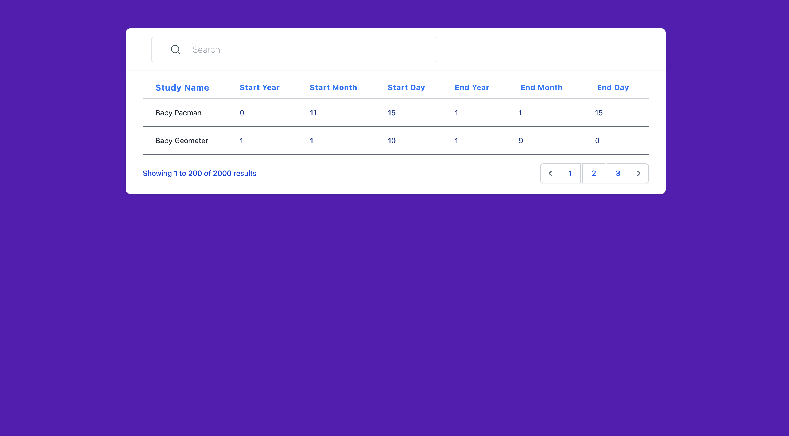
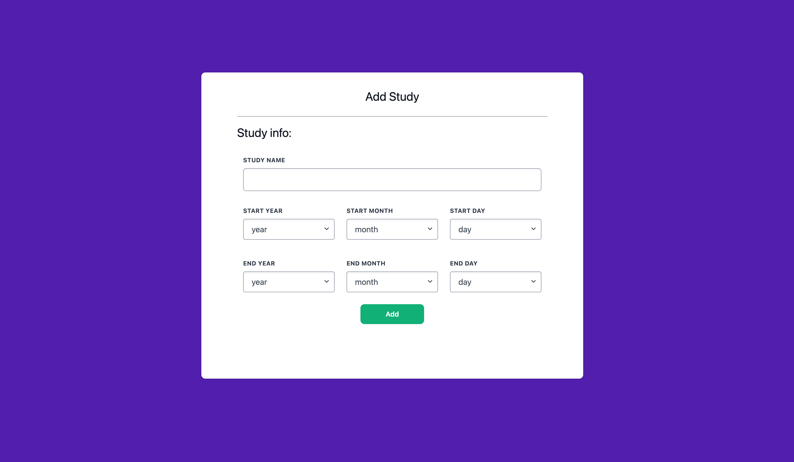
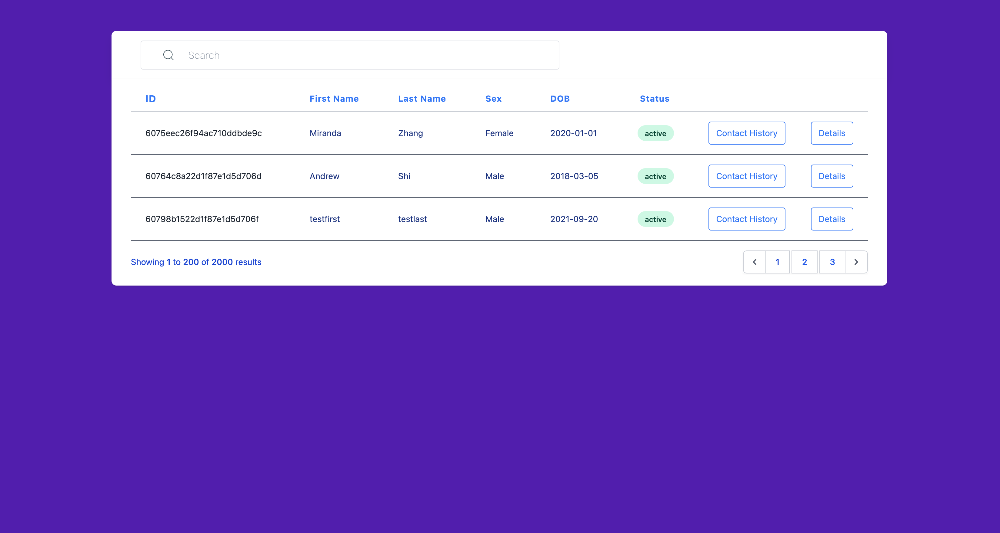
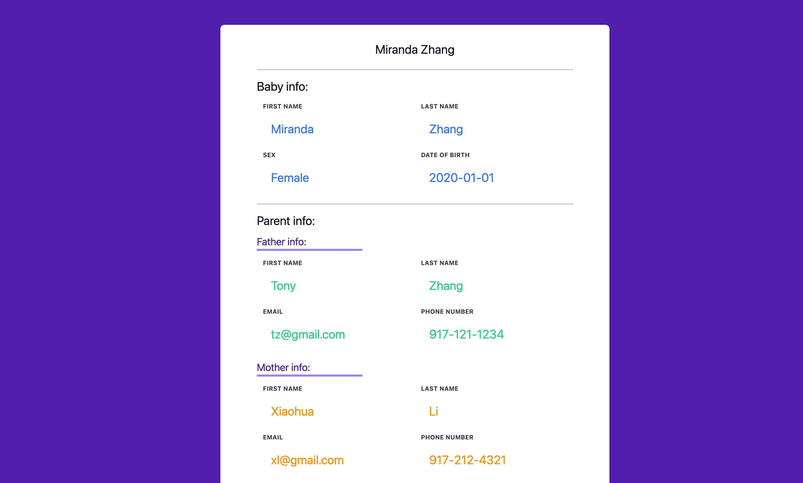
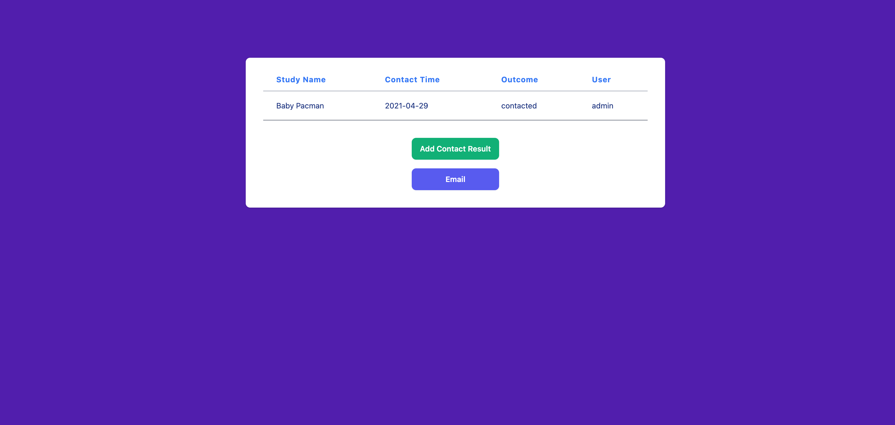
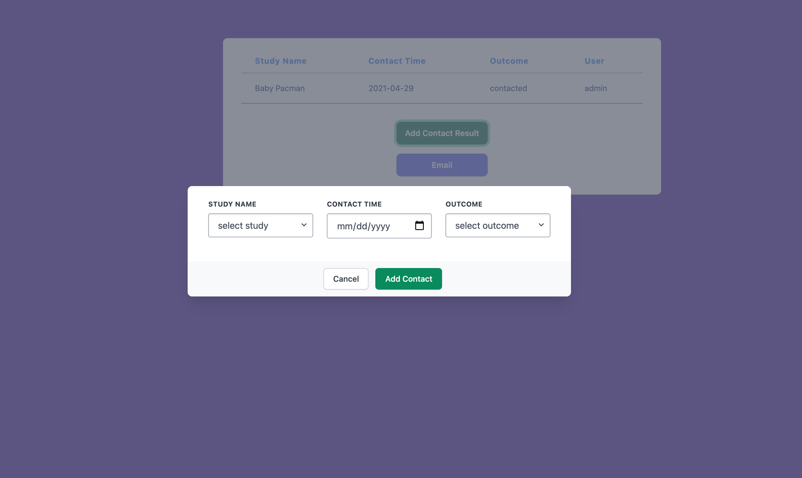
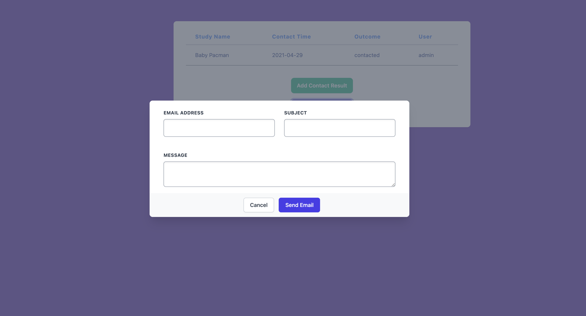
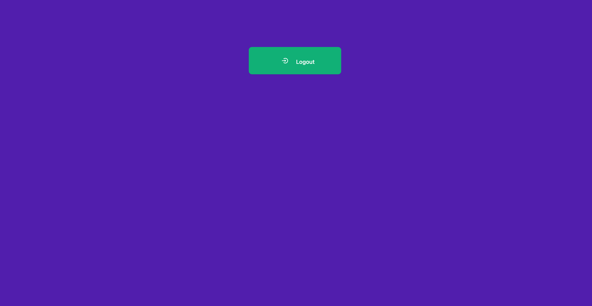

# Infant Study Recruitment System

## Data Model

There will be five schemas: User, Study, Baby, Parent, Result

* A baby will have one pair of parents (via reference)
* A pair of parents will have one or more babies (via reference)
* A baby will participate in multiple studies and will have different outcomes (via reference)


An Example User:

```javascript
{
    username: "anthony",
    password: // a password hash,
    admin: true // identify if the user is admin user
}
```

An Example Study:

```javascript
{
    studyName: "BabyPacMan", 
    startYear: 1,
    endMonth: 1,
    startDay: 0,
    endYear: 0,
    endMonth: 5,
    endDay: 0
}
```

An Example Baby:

```javascript
{
    lastName: "Zhang",
    firstName: "Kevin",
    birthdate: 2016-05-18,
    sex: "male",
    comment: //some comments e.g. the baby is full-term, contact preference,
    parent: //some Parent _id,
    contactResult: //some array of Result _id
}
```

An Example Parent:

```javascript
{
    motherLastName: "Li",
    motherFirstName: "Jane",
    fatherLastName: "Zhang",
    fatherFirstName: "Peter",
    motherPhoneNo: 123456789,
    motherEmail: "abc@gmail.com",
    fatherPhoneNo: 987654321,
    fatherEmail: "def@gmail.com",
    children: //an array of Baby _id
}
```

An Example Study Result:
```javascript
{
    study: "Baby Pac-man",
    lastContactTime: 2020-01-01,
    outcome: "complete"      
}
```

## Wireframes


/login - page for logging in the system



/ - page after logging in


/study - page for showing available babies for the study



/add/study - page for adding study



/record - page for showing all the babies



/baby/detail/:slug - page for showing baby's detail



/baby/history/:slug - 
* page for showing baby's contact history
  
* add contact history
  
* send contact email
  
  
/gmail - page for managing gmail account


## Site map


## User Stories or Use Cases

1. as non-registered user, I will have to ask the administrator to create a user account
2. as an admin user, I can manage users and studies
3. as a user, I can log in to the site
4. as a user, I can select study to pull out eligible babies' information
5. as a user, I can view all the eligible babies
6. as a user, I can check babies' contact history and study history
7. as a user, I can mark the baby have been contacted for the selected study
8. as a user, I can select baby and send a recruitment email based on the selected study if the baby has not been contacted yet(need to research to check if doable)
9. as a user, I can select baby and send a follow-up email
10. as a user, I can mark if the baby has participated in the current study

## Annotations / References Used

1. [Gmail API docs](https://developers.google.com/gmail/api/quickstart/nodejs)
2. [tailwind.css docs](https://tailwindcss.com/)
3. https://tailwindcomponents.com/component/account-setting-2
4. https://tailwindcomponents.com/component/table-1
5. https://developers.google.com/gmail/api/quickstart/js
6. https://unpkg.com/browse/boxicons@2.0.7
7. https://tailwindcomponents.com/component/sidebar-navigation
8. https://tailwindui.com/components/application-ui/overlays/modals
9. https://github.com/sitepoint-editors/gmail-api-javascript-example/blob/master/02%20-%20Sending%20mail/index.html
10. https://developers.google.com/gmail/api/quickstart/js
11. https://tailwindcomponents.com/component/simple-login-social
